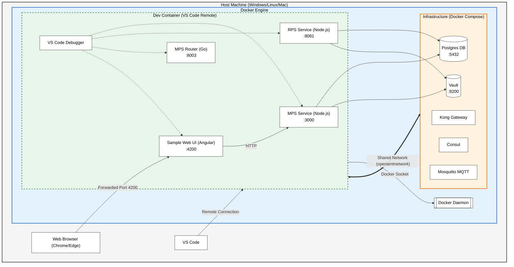

# Cloud Deployment Developer Guide

This guide describes how to develop and debug the Open AMT Cloud Toolkit components using the provided VS Code Dev Container environment.

## Architecture Overview

The development environment uses a **Hybrid** approach:
1.  **Code & Services**: Your application code (MPS, RPS, Router, WebUI) runs *inside* the Dev Container as standard processes. This gives you full IDE support (IntelliSense, Debuggers).
2.  **Infrastructure**: External dependencies (Postgres, Vault, Kong, etc.) run as *Docker containers* alongside the Dev Container, using the host's Docker daemon (Docker-outside-of-Docker).

## Getting Started

### Prerequisites
*   Docker Desktop (or Docker Engine on Linux)
*   VS Code with **Dev Containers** extension installed.

### Initial Setup
1.  Open this folder in VS Code.
2.  When prompted, click **Reopen in Container**. (Or run command: `Dev Containers: Reopen in Container`).

## Running the Environment

### 1. Start Infrastructure
Before running the services, you need the database and other tools up.
*   Open the Command Palette (`Ctrl+Shift+P`).
*   Run **Tasks: Run Task** -> **Start Infrastructure**.
    *   *This spins up Postgres, Vault, Kong, etc.*

### 2. Connect Network
Ensure your Dev Container can talk to the infrastructure containers.
*   Run **Tasks: Run Task** -> **Connect DevContainer to Network**.

### 3. Start Web UI (Optional)
If you are working on the frontend:
*   Run **Tasks: Run Task** -> **Serve WebUI (Angular)**.
*   Wait for compilation to finish.

### 4. Debug Services
*   Go to the **Run and Debug** view (`Ctrl+Shift+D`).
*   Select **"Debug All Services"**.
*   Press **F5**.
    *   This will launch MPS, RPS, and the Router in debug mode.
    *   If Web UI task is running, it will also launch a Chrome window attached to the frontend.

## Configuration Files

*   **.devcontainer/devcontainer.json**: Defines the environment (tools, extensions, port forwarding).
*   **.vscode/launch.json**: Debugger configurations for Node.js (MPS/RPS), Go (Router), and Chrome (WebUI).
*   **.vscode/tasks.json**: Helper scripts to manage Docker containers and build processes.

## Troubleshooting

*   **Database connection failed**: Ensure you ran the "Start Infrastructure" task and the "Connect DevContainer to Network" task. The services look for a host named `db`.
*   **Web UI not accessible**: Make sure the ports are forwarded in the **Ports** view (Ctrl+J -> Ports). Port 4200 should be pointing to localhost:4200.
